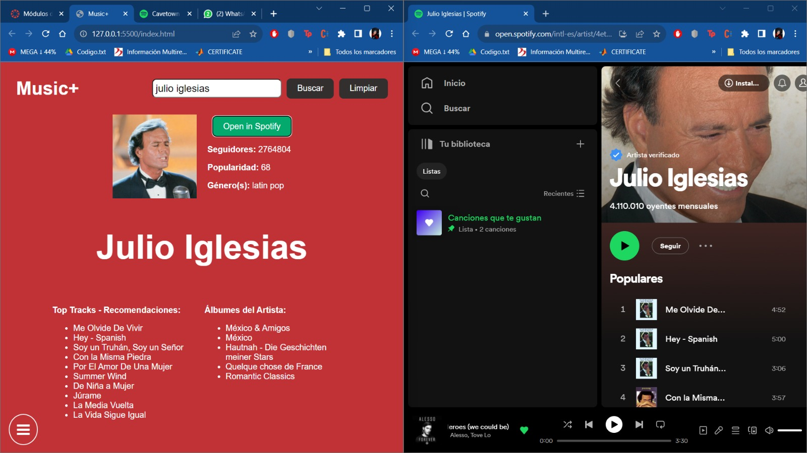

# Front-end-lab03
DBP - Readme

Music+ es una página web alimentada por el API de Spotify que permite a los usuarios la exploración musical, descubrir artistas o información detallada sobre ellos, y conocer recomendaciones de canciones y álbumes. Por otro lado, la aplicación brinda la posibilidad de filtrar por nombre de artistas en esta página y visualizar información relevante, como la popularidad del artista, seguidores, géneros musicales, y acceder a enlaces directos a Spotify. También proporciona detalles sobre las canciones más populares del artista y una lista de álbumes.

Casos de uso del sistema:

Explorar Artistas:
Descripción: Los usuarios pueden utilizar la función de búsqueda para encontrar información detallada sobre un artista específico.
Pasos:
Ingresar el nombre del artista en el campo de búsqueda.
Hacer clic en el botón "Buscar".
Visualizar la información del artista, incluyendo su nombre, imagen, seguidores, popularidad y géneros.

Explorar Canciones Populares:
Descripción: Los usuarios pueden ver las canciones más populares de un artista específico.
Pasos:
Después de buscar un artista, la aplicación muestra una lista de sus canciones más populares.
Visualizar la lista de canciones populares.

Explorar Álbumes del Artista:
Descripción: Los usuarios pueden explorar los álbumes disponibles de un artista.
Pasos:
Después de buscar un artista, la aplicación muestra una lista de sus álbumes.
Visualizar la lista de álbumes del artista.

Abrir en Spotify:
Descripción: Los usuarios pueden abrir el perfil del artista directamente en la aplicación de Spotify.
Pasos:
Después de buscar un artista, hacer clic en el botón "Open in Spotify".
Ser redirigido al perfil del artista en la aplicación de Spotify.

Inicio de Sesión:
Descripción: Los usuarios pueden iniciar sesión en la aplicación para acceder a funcionalidades adicionales o personalizadas.
Pasos:
En la sección de inicio, ingresar el nombre de usuario y la contraseña.
Hacer clic en el botón "Iniciar sesión".
Explorar y Ocultar Secciones:

Descripción: Los usuarios pueden alternar entre la sección de inicio y la sección de búsqueda.
Pasos:
Hacer clic en "Inicio" para ver la sección principal.
Hacer clic en "Explorar" para cambiar a la sección de búsqueda.
Estos casos de uso reflejan las principales interacciones que los usuarios pueden tener con la aplicación Music+.

EJEMPLOS DE FUNCIONALIDADES E INTERACCIONES:

